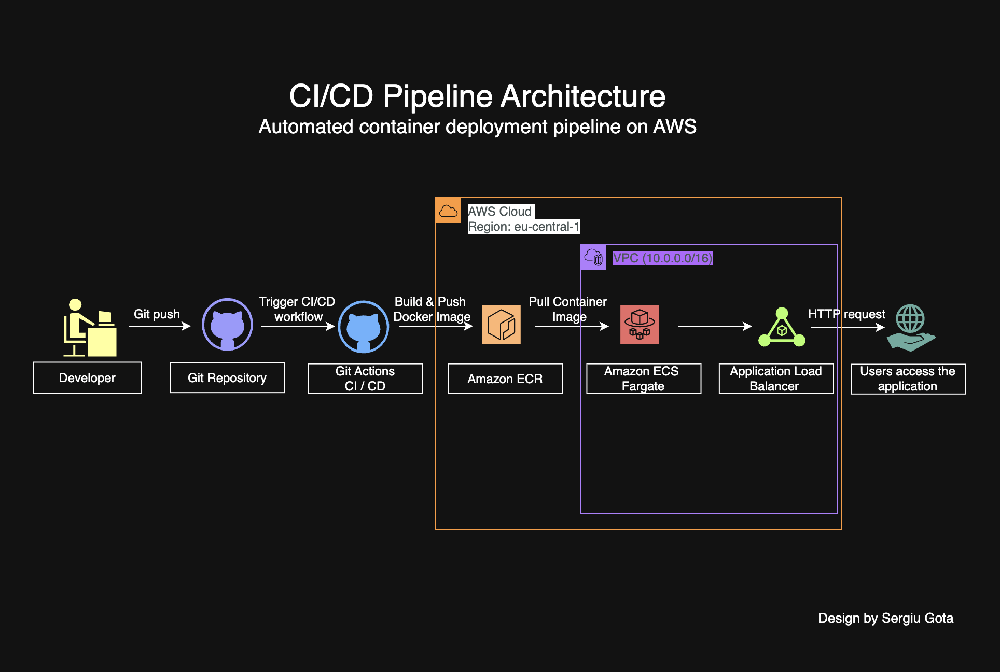
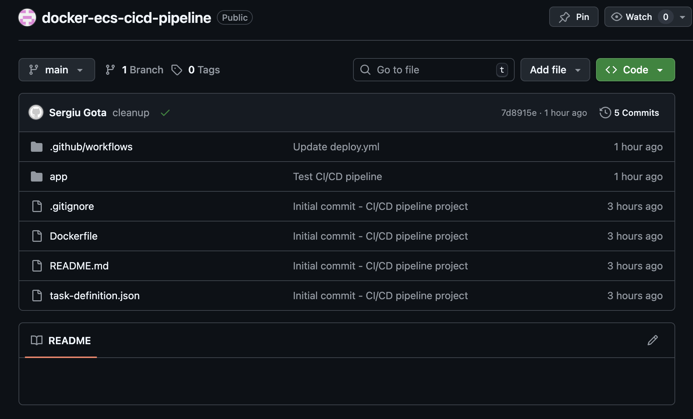
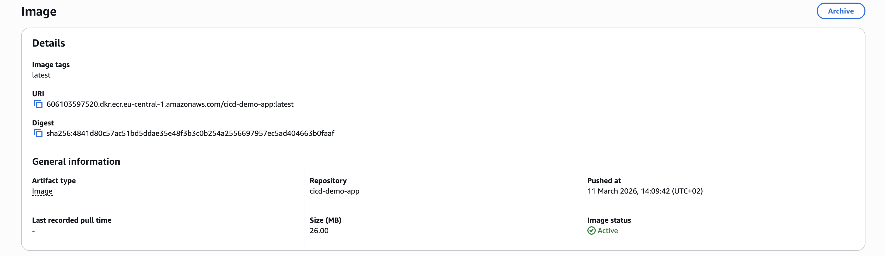
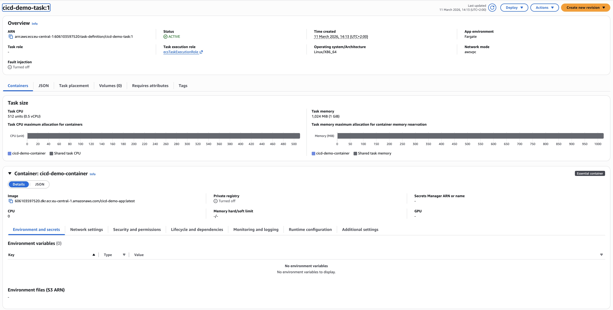
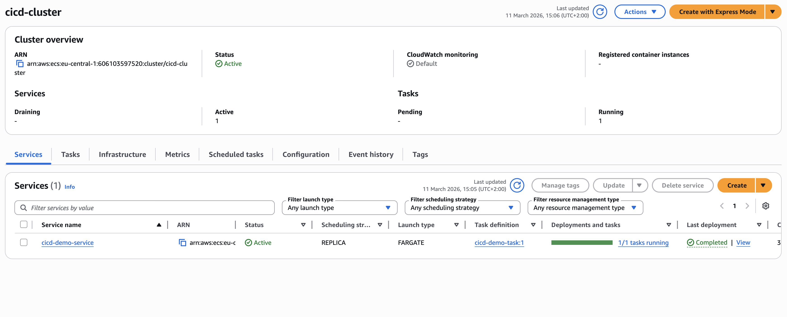
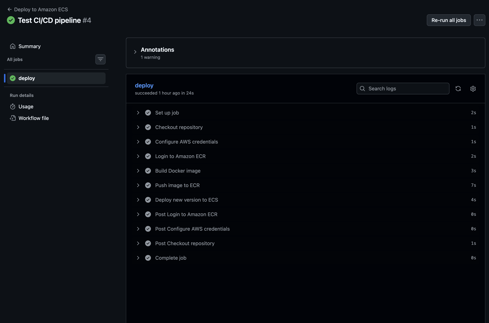
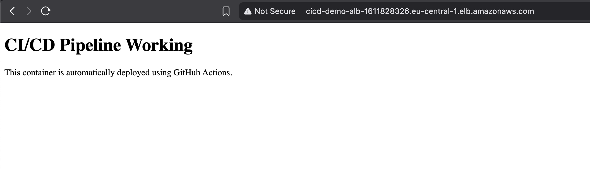

# CI/CD Pipeline on AWS
### Docker · Amazon ECR · ECS Fargate · GitHub Actions

[](https://aws.amazon.com/)
[](https://www.docker.com/)
[](https://aws.amazon.com/ecr/)
[](https://aws.amazon.com/ecs/)
[](https://github.com/features/actions)

---

## Overview

This project implements a fully automated CI/CD pipeline for deploying containerised applications on AWS. A simple web application is packaged into a Docker image, stored in Amazon ECR, and deployed automatically to Amazon ECS Fargate whenever new code is pushed to the GitHub repository — with no manual deployment steps, no SSH sessions, and no infrastructure to babysit between releases.

The pipeline is driven entirely by GitHub Actions, making the workflow reproducible, auditable, and easy to extend. AWS resources are deployed in the **eu-central-1 region** inside a **VPC (10.0.0.0/16)**.

This project simulates a real-world production deployment workflow used by modern cloud engineering teams.

---

## Architecture



```
Developer (Local Machine)
      │
      │  git push
      ▼
GitHub Repository  ── Stores application code, Dockerfile, and workflow config
      │
      │  Triggers on push to main
      ▼
GitHub Actions  ── Builds image, authenticates to AWS, pushes to ECR, deploys to ECS
      │
      ▼
Amazon ECR  ── Private container registry stores versioned image
      │
      ▼
Amazon ECS Fargate  ── Pulls new image, deploys updated task revision
      │
      ▼
Application Load Balancer  ── Exposes application publicly, distributes traffic
      │
      ▼
End Users (Browser)
```

---

## Services Used

| Service | Role |
|---|---|
| **Docker** | Packages the web application into a portable container image |
| **Amazon ECR** | Private container registry for storing and versioning images |
| **Amazon ECS Fargate** | Serverless container orchestration — runs tasks without managing servers |
| **Application Load Balancer** | Distributes inbound HTTP traffic to healthy Fargate tasks |
| **AWS VPC** | Isolated network environment for ECS tasks and load balancer |
| **GitHub Actions** | Automates the build, push, and deploy pipeline on every code push |
| **AWS IAM** | Grants GitHub Actions least-privilege access to ECR and ECS |

---

## Application Flow

1. Developer pushes code to the GitHub repository
2. GitHub Actions detects the push and triggers the CI/CD workflow
3. The workflow builds a fresh Docker image from the updated source
4. The image is tagged and pushed to Amazon ECR
5. GitHub Actions registers a new ECS Task Definition revision referencing the updated image
6. The ECS Service is updated to deploy the new task revision via a rolling deployment
7. Fargate pulls the new image and starts replacement tasks
8. The Application Load Balancer health-checks the new tasks and routes live traffic once healthy

---

## Project Structure

```
docker-ecs-cicd-pipeline/
│
├── .github/
│   └── workflows/
│       └── deploy.yml              # GitHub Actions CI/CD workflow definition
│
├── app/
│   └── index.html                  # Static web application source
│
├── screenshots/
│   ├── 00-architecture-diagram.png         # End-to-end pipeline architecture
│   ├── 01-github-repository-structure.png  # Repository layout and workflow file
│   ├── 02-ecr-image-pushed.png             # Docker image stored in Amazon ECR
│   ├── 03-ecs-task-definition.png          # ECS Task Definition configuration
│   ├── 04-ecs-cluster-service-running.png  # ECS cluster with running service
│   ├── 05-github-actions-pipeline-success.png # Successful pipeline run in GitHub
│   └── 06-live-application-alb.png         # Live application via ALB endpoint
│
├── Dockerfile                      # Container image build instructions
├── task-definition.json            # ECS Task Definition used by the pipeline
└── README.md
```

---

## Screenshots

### 1. GitHub Repository Structure
*Repository layout showing the workflow file, Dockerfile, and application source used by the pipeline.*



---

### 2. Docker Image in Amazon ECR
*Container image successfully pushed to the ECR private registry after a pipeline run, with image tag visible.*



---

### 3. ECS Task Definition
*Task Definition configured with the ECR image URI, container port mapping, and Fargate launch type.*



---

### 4. ECS Cluster and Service Running
*ECS cluster with the service showing the desired task count active and all tasks in a running state.*



---

### 5. GitHub Actions Pipeline
*Successful pipeline run in GitHub Actions showing all steps completed — build, push, and deploy.*



---

### 6. Live Application via ALB
*Web application accessible through the Application Load Balancer public DNS endpoint after automated deployment.*



---

## Troubleshooting

### 1. GitHub Actions Failing to Authenticate with AWS

After writing the initial workflow file and pushing to GitHub, the pipeline was failing at the AWS credentials step. The Actions runner was reporting an authentication error when attempting to call the ECR login action, and no image was being built or pushed.

The root cause was missing GitHub Actions secrets. The workflow referenced `${{ secrets.AWS_ACCESS_KEY_ID }}` and `${{ secrets.AWS_SECRET_ACCESS_KEY }}`, but the secrets had not been added to the repository settings. GitHub Actions silently passes an empty string for undefined secrets rather than failing immediately with a descriptive error, which made the authentication failure appear to be an AWS-side issue at first.

**Fix:** Added the required IAM credentials as repository secrets under Settings → Secrets and variables → Actions. Created a dedicated IAM user with a scoped policy granting only the permissions required — `ecr:GetAuthorizationToken`, `ecr:BatchCheckLayerAvailability`, `ecr:PutImage`, `ecs:RegisterTaskDefinition`, and `ecs:UpdateService` — rather than attaching a broad managed policy.

**Lesson:** Always add GitHub Actions secrets before running the workflow, and scope IAM permissions to exactly what the pipeline needs. When credentials appear to fail silently, check whether the secrets were actually defined — GitHub doesn't surface undefined secrets as errors, it just passes empty values.

---

### 2. ECS Service Not Updating After Successful Pipeline Run

The GitHub Actions pipeline was completing successfully — image pushed to ECR, task definition registered — but the running application in the browser wasn't reflecting the new code. The ECS service appeared healthy and showed no errors, but was still running the old task revision.

The issue was in the `deploy.yml` workflow. The step that called `ecs update-service` was referencing a hardcoded task definition ARN from the first deployment rather than using the ARN output by the `register-task-definition` step. The service was being instructed to deploy the same revision it was already running, so ECS correctly determined no action was needed and made no change.

**Fix:** Updated the workflow to capture the task definition ARN from the output of the registration step using `id: register-task-def` and referencing it as `steps.register-task-def.outputs.task-definition` in the update step. This ensures every pipeline run deploys the revision that was just registered, not a stale reference.

**Lesson:** In CI/CD pipelines, always pass outputs forward dynamically between steps rather than hardcoding ARNs or identifiers from a previous manual setup. Hardcoded values are the most common source of deployments that appear to succeed but don't actually change anything.

---

## What I Learned

This project made clear that CI/CD is an architectural decision, not just a tooling choice — and that the pipeline is as much a part of the system as the application itself.

**Automation removes human error but introduces its own failure modes.** A manual deployment process fails visibly when something goes wrong. An automated pipeline can silently succeed at every step while still not delivering the intended change — as with the stale task definition ARN. Designing pipelines that fail loudly and specifically, rather than completing green while doing nothing, requires deliberate attention to how steps pass state to each other.

**IAM scoping is the discipline that separates a working pipeline from a secure one.** It's easy to get a pipeline running by attaching `AdministratorAccess` to the IAM user. It takes more effort to enumerate exactly which actions the pipeline needs and nothing more. Doing it properly means understanding each AWS API call the workflow makes — ECR authentication, image push, task definition registration, service update — and granting only those permissions. The extra time spent here is worthwhile and carries over to every future project.

**GitHub Actions is a first-class infrastructure tool, not just a scripting environment.** The workflow file is code: it should be version-controlled, reviewed, and treated with the same care as the application source. Using step outputs, environment variables, and scoped secrets properly is what separates a maintainable pipeline from one that breaks the moment an ARN changes or a secret rotates.

**The feedback loop between push and production is the most valuable thing CI/CD delivers.** Watching a code change go from `git push` to a live application update in under two minutes — automatically, repeatably, without any manual steps — is the concrete demonstration of why this pattern exists. The pipeline becomes the shared interface between development and operations, and getting it right compounds in value over time.

---

## Future Improvements

- Separate staging and production environments with branch-based deployment rules
- Slack or email notifications on pipeline success and failure
- CloudWatch Container Insights for task-level metrics and structured log aggregation
- HTTPS with AWS Certificate Manager and an ACM-backed ALB listener
- Terraform for infrastructure provisioning to make the stack fully reproducible as code

---

## Author

**Sergiu Gota**
AWS Certified Solutions Architect – Associate · AWS Cloud Practitioner

[](https://github.com/sergiugotacloud)
[](https://linkedin.com/in/sergiu-gota-cloud)

> Built as part of a cloud portfolio to demonstrate real-world CI/CD pipeline automation on AWS.
> Feel free to fork, adapt, or reach out with questions.
